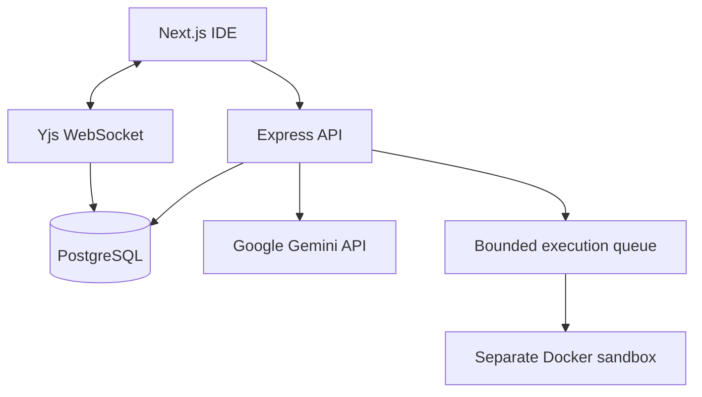

# AI Collaborative Code Editor

An AI-assisted real-time collaborative IDE built with Next.js, Express, PostgreSQL, Yjs, Socket.IO, and Docker.

## Features

- HTTP-only cookie authentication and owner authorization
- Multi-file rooms with Monaco editor and Yjs CRDT synchronization
- Presence, chat, version snapshots, and restore
- Docker-only code execution with CPU, memory, PID, output, network, and timeout limits
- Project-aware AI explain, review, fix, test, and generation workflows
- Project indexing, relevant-file search, project Q&A, and approval-gated AI proposals
- Health/readiness endpoints, structured logs, request limits, migrations, and Compose services

## Architecture



The browser receives only `NEXT_PUBLIC_BACKEND_URL` and `NEXT_PUBLIC_YJS_URL`. The Gemini key, JWT secret, database URL, and Docker access remain server-side.

See [architecture.md](architecture.md) for the responsibility boundaries, trust model, and scaling direction.

## Local setup

1. Copy `backend/.env.example` to `backend/.env` and set the local database values.
2. Start PostgreSQL and Docker Desktop.
3. Run `npm install` in `backend` and `frontend`.
4. Run `npm run migrate` in `backend`.
5. Run `npm run dev` in both `backend` and `frontend`; start Yjs with `npm run yjs`.

For the container topology, set `POSTGRES_PASSWORD` and `JWT_SECRET`, then run:

```powershell
docker compose up --build
```

## Environment variables

Backend: `DATABASE_URL`, `JWT_SECRET`, `GEMINI_API_KEY`, `GEMINI_MODEL`, `FRONTEND_URL`, `CORS_ORIGIN`, and `YJS_URL`. Frontend: `NEXT_PUBLIC_BACKEND_URL` and `NEXT_PUBLIC_YJS_URL` only. Never commit production secrets.

## API and security

Authentication, room ownership, parameterized SQL, Helmet, CORS allowlists, bounded JSON, route rate limits, and generic production errors are enforced in the backend. Execution is never performed on the host. Production deployment still requires TLS, managed secret storage, backups, Docker security tests, and explicit room membership roles.

## Testing

```powershell
cd backend; npm test
cd ../frontend; npm run build
```

## Deployment

Deploy frontend, backend, migration, Yjs, and PostgreSQL as separate services behind a TLS reverse proxy. Route secure WebSocket upgrades to Yjs, use a managed PostgreSQL backup policy, and configure `CORS_ORIGIN` to the exact HTTPS frontend origin. Release and placement guidance is in [notes16.md](notes16.md); Part 14 deployment details are in [notes14.md](notes14.md).

## Future improvements

Streaming AI responses, durable execution workers, Redis-backed multi-instance WebSockets, object storage, metrics/alerts, browser acceptance tests, and public load testing.
