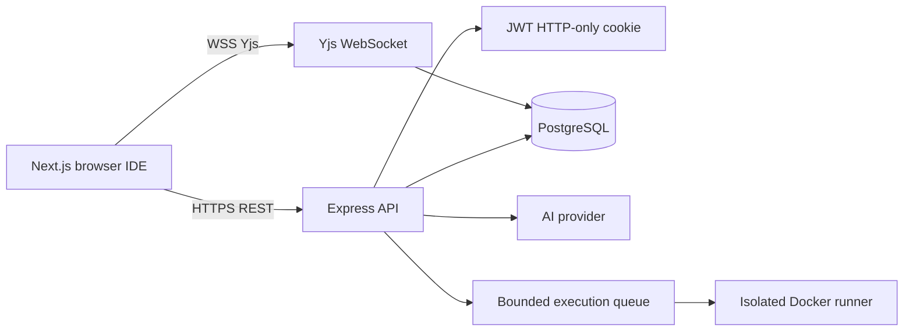

# CodeCollab Architecture

## System view

## Responsibilities

- **Frontend:** authentication screens, room dashboard, Monaco editor, file explorer, chat, presence, version history, execution output, and AI controls.
- **Backend API:** authentication, room/file authorization, persistence, AI context, usage telemetry, execution authorization, Socket.IO events, health, and readiness.
- **Yjs service:** authenticated WebSocket document synchronization and awareness. It does not own durable file metadata.
- **PostgreSQL:** users, rooms, files, chat, file versions, migrations, and AI usage events.
- **Docker runner:** untrusted source execution only. The runner has no network, uses a read-only mount, drops capabilities, runs as non-root, and enforces CPU, memory, PID, output, and timeout limits.

## Data flow

1. A user authenticates and receives an HTTP-only JWT cookie.
2. Protected API routes verify the token and room ownership before reading or mutating data.
3. The room page loads durable files over HTTP, then opens one authenticated Yjs document per file.
4. Yjs distributes concurrent text updates and awareness; file saves create durable version snapshots.
5. Execution requests enter a bounded queue and run in a separate Docker container.
6. AI requests are rate-limited, context-bounded, usage-recorded, and return explanations or approval-gated proposals. They never silently write files.

## Production scaling direction

The current deployment is suitable for a portfolio deployment and small rooms. Larger deployments should add a reverse proxy, managed PostgreSQL, Redis-backed Socket.IO/Yjs coordination, stateless API replicas, dedicated execution workers, object storage for large projects, and centralized metrics/logging.

## Trust boundaries

Browser input, room files, AI output, and executed code are untrusted. Secrets stay in backend environment variables. SQL is parameterized. Authorization is enforced server-side. Any future AI tool must use explicit permissions, bounded iterations, audit events, and user approval before mutation.
